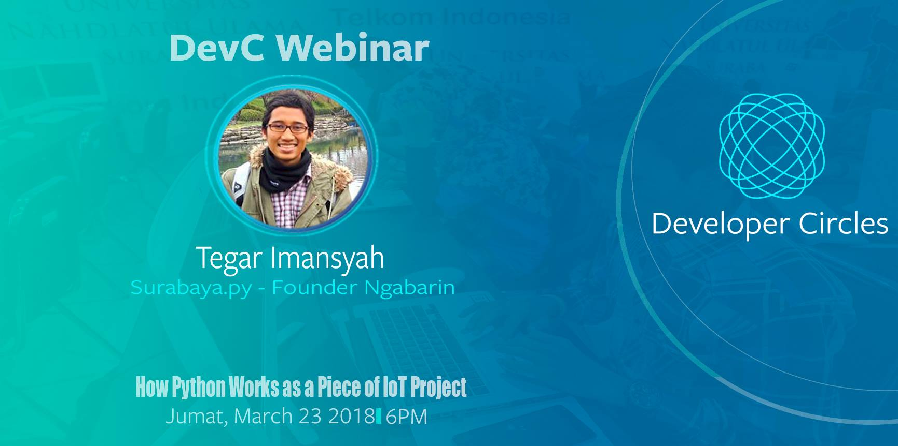

# Open Smart Lighting System

Ini adalah pengembangan dari webinar tentang "How Python Works as a Piece of IoT Projects". Kegiatan tersebut hasil kerja sama Surabaya.py dengan Facebook Dev Circle Surabaya.

File presentasi dan dokumen pendukung ada di folder belajar.

webinar bisa dilihat di [https://www.facebook.com/groups/DevCSurabaya/permalink/2034936890079026/](https://www.facebook.com/groups/DevCSurabaya/permalink/2034936890079026/)
